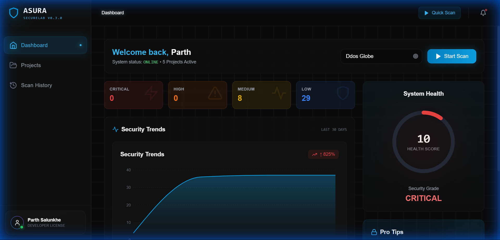
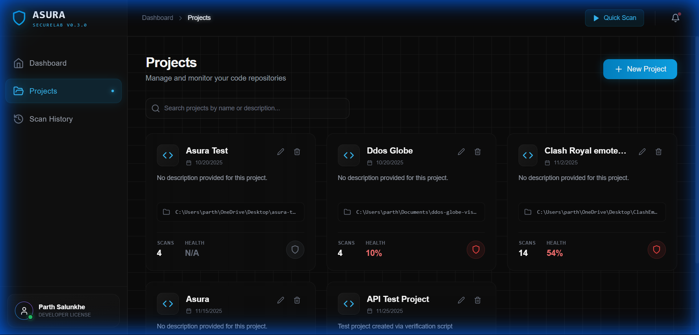
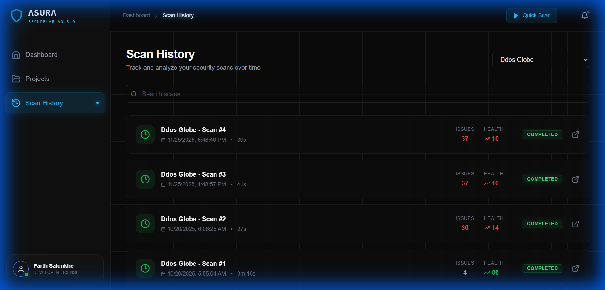
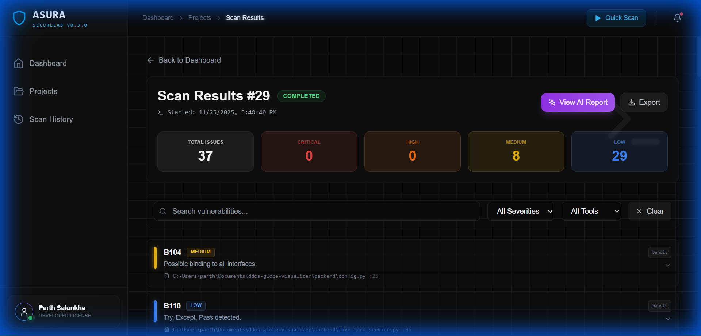
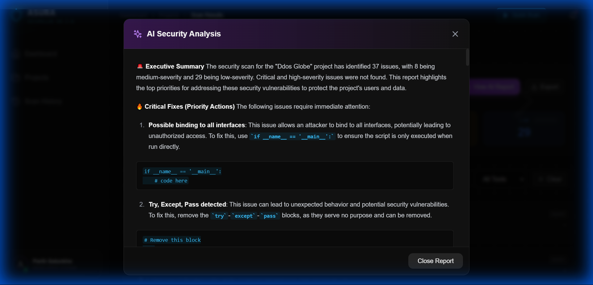

# 🔥 ASURA - AI SecureLab

[](https://opensource.org/licenses/MIT)
[](https://www.python.org/downloads/)
[](https://reactjs.org/)
[](docs/CHANGELOG.md)

> **Your intelligent, privacy-first security companion.**

Asura transforms the tedious process of security auditing into a seamless part of your workflow. Instead of manually wrangling multiple CLI tools or risking data privacy with cloud scanners, Asura provides a unified, local dashboard that identifies vulnerabilities and—crucially—tells you exactly how to fix them.

It combines industry-standard static analysis with local AI to act as a **private security analyst**, saving you hours of debugging time while ensuring your code never leaves your machine.

---

## ⚡ Technical Architecture

Asura is built for performance, privacy, and extensibility.

- **Core Engine**: A high-performance **FastAPI** backend orchestrates local CLI tools (Bandit, Semgrep, Safety) to analyze code in real-time.
- **Data Layer**: Results are parsed and stored in a local **SQLite** database via **SQLAlchemy**, ensuring zero data latency and complete privacy.
- **Intelligence**: An integrated AI layer processes scan results to generate natural language explanations and code fixes, running entirely offline or via optional API integrations.
- **Interface**: A modern **React 18** frontend with **Vite** and **TailwindCSS** provides a responsive, professional dashboard for managing security insights.

---

## ✨ Key Features

### 🔒 Comprehensive Security Scanning
- **Bandit**: Python security linter for common vulnerabilities.
- **Safety**: Checks dependencies against known CVEs.
- **Semgrep**: Multi-language static analysis with 1000+ rules.
- **Real-time Progress**: Watch scans execute live.

### 🤖 AI-Powered Analysis
- **Smart Explanations**: AI explains vulnerabilities in plain English.
- **Auto-Fix Suggestions**: Get secure code alternatives instantly.
- **AI Auto Fix Prompt**: Generate prompts for AI IDEs (Cursor, Windsurf) to fix issues automatically.
- **Offline Capable**: Core scanning works perfectly without AI.

### 📊 Code Quality & Metrics
- **Health Scoring**: A-F grading based on security and coverage.
- **Complexity Analysis**: Radon-powered cyclomatic complexity checks.
- **Test Coverage**: Integrated Pytest coverage reporting.

### 🔐 Privacy First
- **Local Execution**: All scans run on your machine.
- **No Telemetry**: Your code never leaves your computer.
- **Optional Cloud**: AI features are opt-in; everything else is local.

---

## 📸 Screenshots

### Dashboard
Get a complete overview of your project health, security scores, and vulnerability distribution.


### Project Management
Manage multiple projects easily from a clean, intuitive interface.


### Scan History
View and compare past scans to track improvements over time.


### Detailed Scan Report
Drill down into specific vulnerabilities with code snippets and severity levels.


### AI Summary & Fixes
Understand issues quickly with AI-generated summaries and fix suggestions.


---

## 🚀 Quick Start

### One-Click Setup (Windows)
```bash
git clone https://github.com/ParthSalunkhe7052/Asura-Security-Scan.git
cd Asura-Security-Scan
setup.bat
start.bat
```

### Manual Setup

**Backend**
```bash
cd backend
python -m venv venv
.\venv\Scripts\activate
pip install -r requirements.txt
uvicorn app.main:app --reload --port 8000
```

**Frontend**
```bash
cd frontend
npm install
npm run dev
```
Access the app at `http://localhost:5173`.

---

## 📁 Project Structure

```
asura/
├── backend/
│   ├── app/
│   │   ├── api/          # API endpoints
│   │   ├── core/         # Scanners & AI logic
│   │   └── models/       # Database models
│   ├── tests/            # Pytest suite
│   └── requirements.txt
├── frontend/
│   ├── src/
│   │   ├── components/   # UI Components
│   │   └── pages/        # Application Pages
│   └── package.json
├── screenshots/          # Project screenshots
├── docs/                 # Documentation
└── README.md             # This file
```

---

## 🗺️ Roadmap

- [ ] **Mutation Testing**: Integrate Mutmut for Python.
- [ ] **CI/CD Integration**: GitHub Actions support.
- [ ] **Report Export**: PDF and improved HTML reports.
- [ ] **More Languages**: Support for Go, Rust, and Java.

---

## 🤝 Contributing

Contributions are welcome! Please check out [CONTRIBUTING.md](docs/CONTRIBUTING.md) for guidelines.

## 📝 License

This project is licensed under the MIT License - see the [LICENSE](LICENSE) file for details.

---

**Built with ❤️ by Parth Salunkhe**
